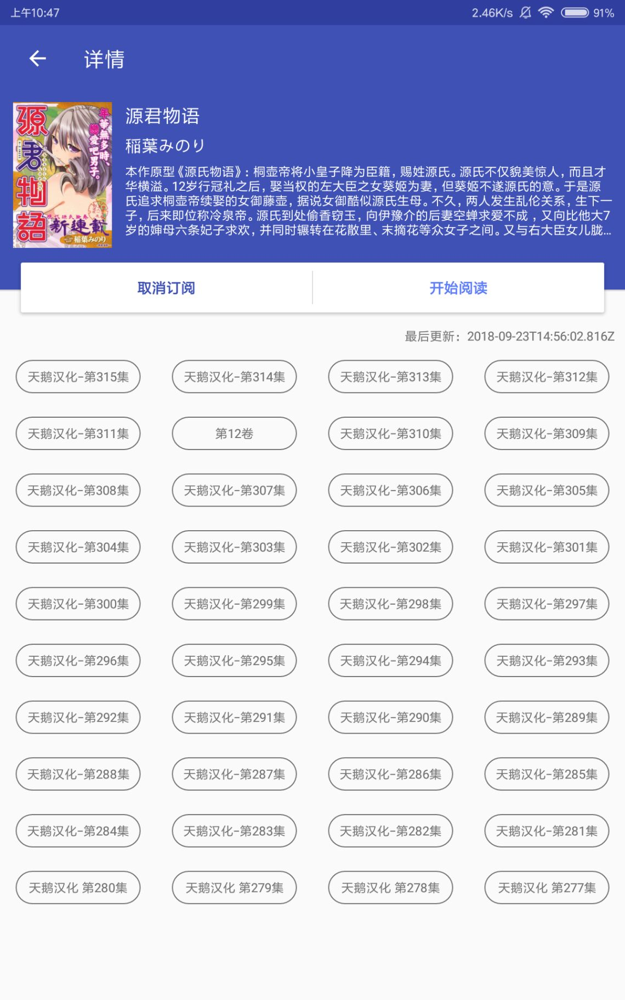
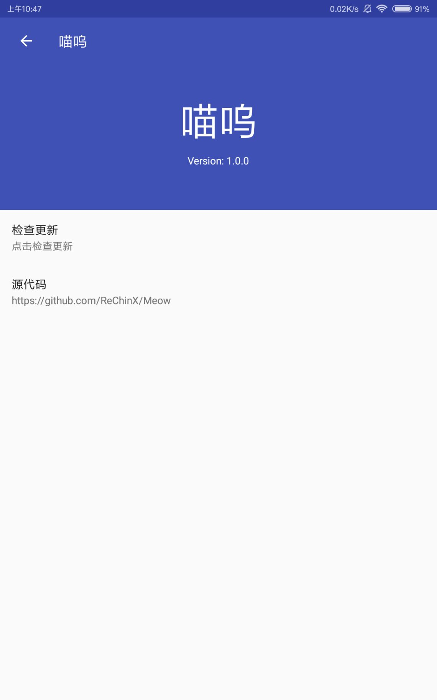
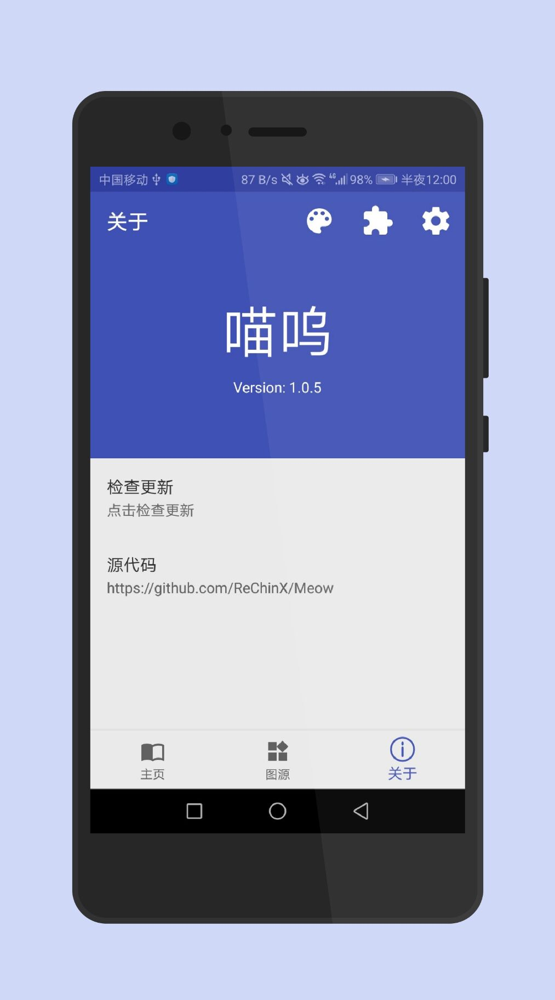
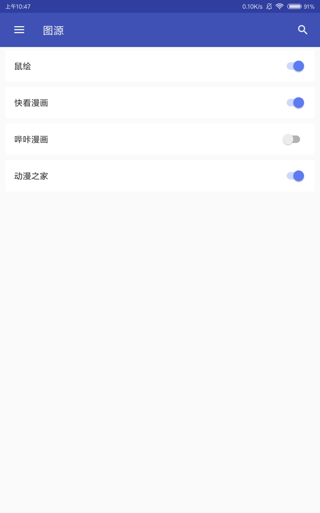

# Meow for Android

Another comic reader client for Android.

You can download release version from here: <https://github.com/ReChinX/Meow/releases>

## Screenshots





## Introduction

- Page reading

- Scorll reading

- Auto update

- Login support

- Plugin-like comic source

## Thanks

- [Rxjava2](https://github.com/ReactiveX/RxJava)
- [ButterKnife](https://github.com/JakeWharton/butterknife)
- [Okhttp](https://github.com/square/okhttp)
- [Glide](https://github.com/bumptech/glide)
- [DiscreteSeekBar](https://github.com/AnderWeb/discreteSeekBar)
- [PhotoView](https://github.com/chrisbanes/PhotoView)
- [SmartRefreshLayout](https://github.com/scwang90/SmartRefreshLayout)
- [MaterialSearchView](https://github.com/MiguelCatalan/MaterialSearchView)
- [J2V8](https://github.com/eclipsesource/J2V8)
- [RxPermissions](https://github.com/tbruyelle/RxPermissions)
- [CheckVersionLib](https://github.com/AlexLiuSheng/CheckVersionLib)
- [SiteD](https://github.com/noear/SiteD)


## License

```
GNU GENERAL PUBLIC LICENSE Version 3, 29 June 2007

Copyright (C) 2018 Chin

This program comes with ABSOLUTELY NO WARRANTY.
This is free software, and you are welcome to redistribute it under certain conditions.
```

